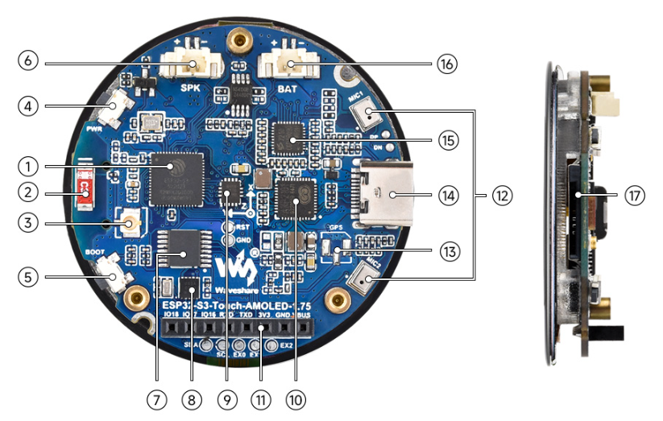
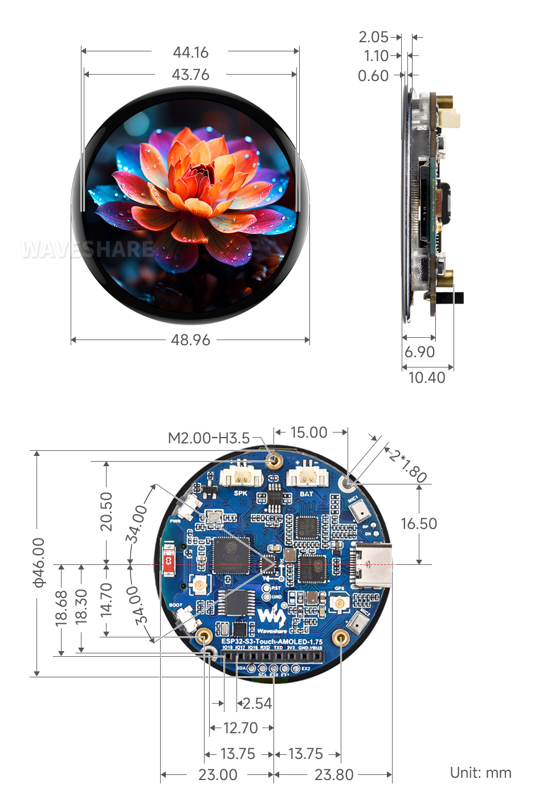
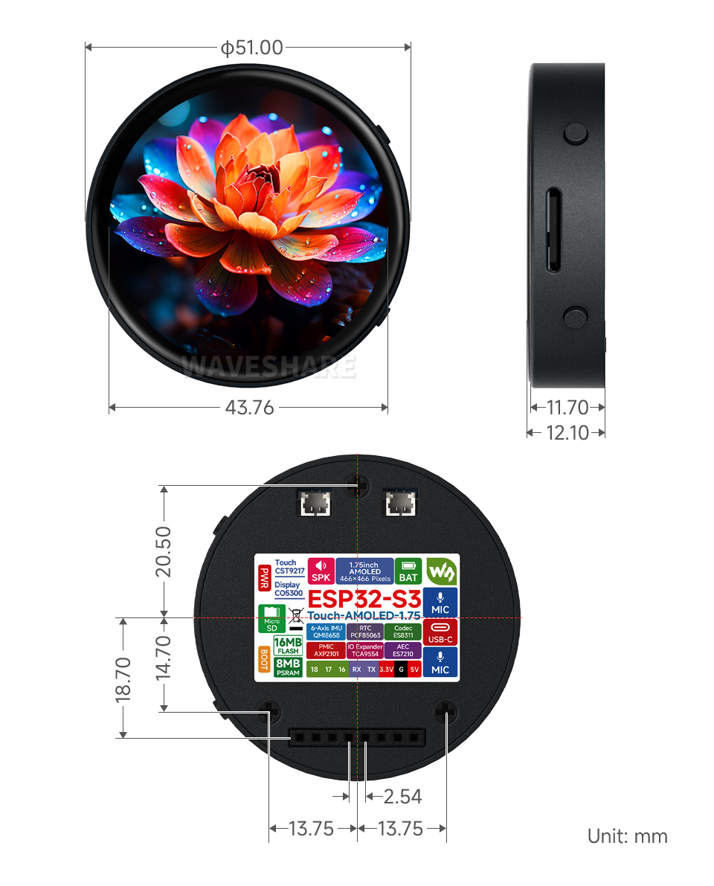

# ESP32-S3-Touch-AMOLED-1.75

## Overview

### Introduction

ESP32-S3-Touch-AMOLED-1.75 is a high-performance MCU board designed by Waveshare. Despite its compact size, it integrates a 1.75inch capacitive touch AMOLED, power management chip, 6-axis IMU sensor (3-axis accelerometer and 3-axis gyroscope), RTC, TF slot, microphone, speaker and various other peripherals on board for easy development and embedding into the product.

### Features

- Equipped with high-performance Xtensa® 32-bit LX7 dual-core processor, up to 240 MHz main frequency
- Supports 2.4GHz Wi-Fi (802.11 b/g/n) and Bluetooth® 5 (BLE), with onboard antenna
- Built in 512KB SRAM and 384KB ROM, with onboard 8MB PSRAM and an external 16MB Flash
- Built-in 1.75inch capacitive touch AMOLED screen with a resolution of 466×466, 16.7M colors for clear color pictures

### Hardware Description

- Built-in 1.75inch high-definition capacitive touch AMOLED screen with a resolution of 466×466, 16.7M colors for clear color pictures
- Embedded with CO5300 driver chip and CST9217 capacitive touch chip, communicating through QSPI and I2C interfaces respectively, minimizes required IO pins
- Onboard QMI8658 6-axis IMU (3-axis accelerometer and 3-axis gyroscope) for detecting motion gesture, step counting, etc.
- Onboard PCF85063 RTC chip connected to the battery via the AXP2101 for uninterrupted power supply
- Onboard PWR and BOOT two side buttons with customizable functions, allowing for custom function development
- Onboard 3.7V MX1.25 lithium battery recharge/discharge header
- Onboard 8Pin header, providing 3 GPIOs and 1 UART, for external device connection and debugging, with flexible peripheral function configuration
- Onboard TF card slot for extended storage and fast data transfer, flexible for data recording and media playback, simplifying circuit design
- The benefits of using AXP2101 include efficient power management, support for multiple output voltages, charging and battery management functions, and optimization for battery life
- The AMOLED screen has the advantages of higher contrast, wider viewing angles, richer colors, faster response, thinner design, lower power consumption, and flexibility



1. **ESP32-S3R8**
   WiFi and Bluetooth SoC, up to 240MHz operating frequency, with onboard 8MB PSRAM
2. **Onboard SMD antenna**
   Supports 2.4GHz Wi-Fi (802.11 b/g/n) and Bluetooth 5 (LE)
3. **Onboard IPEX Gen 1 antenna holder**
   External antenna selectable by switching resistors
4. **PWR power button**
   Controllable power on/off, supports custom function
5. **BOOT button**
   For device startup and functional debugging
6. **MX1.25 2P speaker interface**
   MX1.25 2P connector for speaker access
7. **TCA9554**
   IO expansion chip for expanding IO
8. **PCF85063**
    RTC clock chip
9. **QMI8658**
   6-axis IMU includes a 3-axis gyroscope and a 3-axis accelerometer
10. **AXP2101**
   Highly integrated power management chip
11. **2.54mm pitch 8PIN header**
   For external debugging or connecting sensors
12. **Dual-microphone design**
   Higher quality audio capture with echo cancellation circuit
13. **IPEX Gen 1 GPS antenna holder**
   Built-in LC76G module with GPS version, external GPS ceramic antenna
14. **Type-C interface**
   ESP32-S3 USB Interface for program flashing and log printing
15. **ES7210 echo cancellation algorithm chip**
   Echo cancellation algorithm chip for eliminating echo and improving audio acquisition accuracy
16. **MX1.25 Lithium battery interface**
   MX1.25 2P connector, for 3.7V Lithium battery, supports charging and discharging
17. **TF card slot**

### Dimensions




### Screen Description

#### Touch and its Controller

This touch screen is composed of surface toughened glass + thin film material, which has high strength, high hardness, and good light transmittance. It is equipped with FT3168 self-capacitance touch chip as the driver chip, which supports the I2C communication protocol standard and can realize a 10Khz~400Khz configurable communication rate.

## Usage Instructions

ESP32-S3-Touch-AMOLED-1.75 currently provides two development tools and frameworks, Arduino IDE and ESP-IDF, providing flexible development options, you can choose the right development tool according to your project needs and personal habits.

### Development Tools

#### Arduino IDE

Arduino IDE is an open source electronic prototyping platform, convenient and flexible, easy to get started. After a simple learning, you can start to develop quickly. At the same time, Arduino has a large global user community, providing an abundance of open source code, project examples and tutorials, as well as rich library resources, encapsulating complex functions, allowing developers to quickly implement various functions.

#### ESP-IDF

ESP-IDF, or full name Espressif IDE, is a professional development framework introduced by Espressif Technology for the ESP series chips. It is developed using the C language, including a compiler, debugger, and flashing tool, etc., and can be developed via the command lines or through an integrated development environment (such as Visual Studio Code with the Espressif IDF plugin). The plugin offers features such as code navigation, project management, and debugging, etc.

Each of these two development approaches has its own advantages, and developers can choose according to their needs and skill levels. Arduino are suitable for beginners and non-professionals because they are easy to learn and quick to get started. ESP-IDF is a better choice for developers with a professional background or high performance requirements, as it provides more advanced development tools and greater control capabilities for the development of complex projects.

### Components Preparation

- ESP32-S3-Touch-AMOLED-1.75 x1
- Speaker (not required) x1
- Lithium polymer batteries (not required) x1
- TF card (not required) x1
- USB cable (Type A male to Type C male) x1

> [!WARNING]
>
> If it is used with a lithium battery, the necessary protective measures must be taken. The plastic casing of the product is used only for basic isolation of the circuit board and battery, and is generally safe under normal usage conditions. However, in the actual use and storage process, users still need to pay attention to moisture, high temperature, drop and bump, and avoid overcharging or overdischarging. It is recommended to remove the battery for storage when not in use for a long time, and make sure that the lithium battery does not stay in a low state of power for a long time. If you choose to select the battery yourself, be sure to choose a lithium battery product that is safe and compliant, has protective functions, and can withstand high temperatures. Do not use a cheap and low-quality product.

#### Precautions for Using Lithium Batteries

- Lithium polymer and lithium-ion batteries are very unstable. They may cause fire, personal injury, or property damage, if they're not properly recharged or used.
- When charging and discharging the battery pack, never connect the electrodes incorrectly. Do not use inferior charger/charging panel to recharge the battery.
- Do not mix and use old batteries with new ones, and avoid using batteries from other brands.
- If you need to purchase additional lithium-ion battery products, ensure that the battery parameters are compatible with the lithium-ion battery expansion board. It is recommended to choose batteries from legitimate manufacturers and perform your own aging tests to ensure that the lithium-ion battery can operate stably and safely.
- Lithium batteries have a cycle life, please replace the old batteries with new ones when it reaches the end of its useful life or uses it for two years, whichever comes first.
- Please handle battery products properly, keep them away from flammable and explosive items, and keep them out of reach of children to avoid accidents due to improper storage.

> [!WARNING]
>
> Before operating, it is recommended to browse the table of contents to quickly understand the document structure. For smooth operation, please read the [FAQ](https://www.waveshare.com/wiki/ESP32-S3-Touch-AMOLED-1.75#FAQ) carefully to understand possible problems in advance. All resources in the document are provided with hyperlinks for easy download.

## Working with Arduino

This chapter introduces setting up the Arduino environment, including the Arduino IDE, management of ESP32 boards, installation of related libraries, program compilation and downloading, as well as testing demos. It aims to help users master the development board and facilitate secondary development.

1. Download Arduino IDE
2. Install Development Board
3. Install Library Files
4. Practice Demo

### Environment Setup

#### Download and Install Arduino IDE

Click to visit the [Arduino official website](https://www.arduino.cc/en/software), select the corresponding system and system bit to download


Run the installer and install all by default

> [!NOTE]
>
> The environment setup is carried out on the Windows 10 system, Linux and Mac users can access [Arduino-esp32 environment setup](https://docs.espressif.com/projects/arduino-esp32/en/latest/installing.html) for reference

#### Install ESP32 Development Board

Before using ESP32-related motherboards with the Arduino IDE, you must first install the software package for the **esp32 by Espressif Systems** development board

According to **board installation requirement**, it is generally recommended to use **Install Online**. If online installation fails, use **Install Offline**.

For the installation tutorial, please refer to [Arduino board manager tutorial](https://www.waveshare.com/wiki/Arduino_Board_Managers_Tutorial).

##### ESP32-S3-Touch-AMOLED-1.75 required development board installation description

| Board name | Board installation requirement | Version number requirement |
|-|-|-|
| esp32 by Espressif Systems | "Install Offline" / "Install Online" | 3.1.0 |

#### Install Library

When installing Arduino libraries, there are usually two ways to choose from: **Install online** and **Install offline**.

> [!WARNING]
>
> If the library installation requires offline installation, you must use the provided library file

For most libraries, users can easily search and install them through the online library manager of the Arduino software. However, some open-source libraries or custom libraries are not synchronized to the Arduino Library Manager, so they cannot be acquired through online searches. In this case, users can only manually install these libraries offline.

ESP32-S3-Touch-AMOLED-1.75 library file is stored in the sample program, click here to jump: [ESP32-S3-Touch-AMOLED-1.75 Demo](https://www.waveshare.com/wiki/ESP32-S3-Touch-AMOLED-1.75#Resources)

For library installation tutorial, please refer to[ Arduino library manager tutorial](https://www.waveshare.com/wiki/Arduino_Library_Manager_Tutorial)

#### ESP32-S3-Touch-AMOLED-1.75 Library file instructions

Library Name | Description | Version | Library Installation Requirement
|-|-|-|-|
GFX_Library_for_Arduino | GFX graphical library for CO5300 | - | "Install Offline"
ESP32_IO_Expander | TCA9554 expansion chip driver library | v0.0.3 | "Install Online" or "Install Offline"
lvgl | LVGL graphical library | v8.4.0 | "Install Online" requires copying the demos folder to src after installation. "Install Offline" is recommended
SensorLib | PCF85063, QMI8658 and CST9217 sensor driver library | v0.3.1 | "Install Online" or "Install Offline"
XPowersLib | XP2101 power management chip driver library | v0.2.6 | "Install Online" or "Install Offline"
Mylibrary | Development board pin macro definition | - | "Install Offline"
lv_conf.h | LVGL configuration file | - | "Install Offline"

### Run the First Arduino Demo

> [!NOTE]
>
> If you are just getting started with ESP32 and Arduino, and you don't know how to create, compile, flash, and run Arduino ESP32 programs, then please expand and take a look. Hope it can help you!

#### New Project

- Run the Arduino IDE and select **File** -> **New Sketch**
  
- Enter the code:

  ```
  void setup() {
  // put your setup code here, to run once:
  Serial.begin(115200);
  }

  void loop() {
  // put your main code here, to run repeatedly:
  Serial.println("Hello, World!");
  delay(2000);
  }
  ```

- Save the project and select **File** -> **Save As...**. In the pop-up menu, select the path to save the project, and enter a project name, such as **Hello_World**, click Save


#### Compile and Flash Demos

- Select the corresponding development board, take the ESP32S3 motherboard as an example:
  1. Click to select the dropdown menu option Select Other Board and Port;
  2. Search for the required development board model esp32s3 dev module and select;
  3. Select COM Port;
  4. Save the selection.
  
- If the ESP32S3 mainboard only has a USB port, you need to enable **USB CDC**, as shown in the following diagram:
  
- Compile and upload the program:
  1. Compile the program
  2. Compile and download the program
  3. Download successful
ESP32-S3-AMOLED-1.91-Ar-study-05.png
- Open the **Serial Monitor** window, and the demo will print "Hello World!" every 2 seconds, and the operation is as follows:
  

### Demo

#### 01_HelloWorld

##### Demo description

This demo demonstrates how to control the CO5300 display using the Arduino GFX library, demonstrating basic graphics library functionality with dynamically changing text. This code can also be used to test the basic performance of the display and the effect of displaying random text

##### Hardware connection

Connect the development board to the computer

##### Code analysis

Initialize the display:

```
if (!gfx->begin()) {
  USBSerial.println("gfx->begin() failed!");
}
```

Clear the screen and display text:

```
gfx->fillScreen(BLACK);
gfx->setCursor(10, 10);
gfx->setTextColor(RED);
gfx->println("Hello World!");
```

GIF display:

```
gfx->setCursor(random(gfx->width()), random(gfx->height()));
gfx->setTextColor(random(0xffff), random(0xffff));
gfx->setTextSize(random(6), random(6), random(2));
gfx->println("Hello World!");
```

##### Result demonstration


#### 03_LVGL_PCF85063_simpleTime

##### Demo description

This demo demonstrates how to use the PCF85063 RTC module under LVGL to display the current time on a CO5300 display screen, retrieving the time every second and only updating the display when the time changes, which is better than time refresh

##### Hardware connection

Connect the development board to the computer

##### Code analysis

`setup`: Responsible for initializing various hardware devices and LVGL graphics library environment
- Serial port initialization: `USBSerial.begin(115200)` prepares for serial port debugging
- Real-time clock initialization: Try to initialize the real-time clock `rtc`, enter a loop if it fails. Set the date and time
- Touch controller initialization: Keep trying to initialize the touch controller `CST9217`, if initialization fails, print an error message and wait with a delay, and print a success message if successful
- Graphical display initialization: Initialize the graphical display device `gfx`, set the brightness, and print the version information of LVGL and Arduino. Next, initialize the LVGL, including registering the print callback function for debugging, initializing the display driver and the input device driver. Create and start the LVGL timer, finally create a label and set the initial text to "Initializing..."

`loop`

- `lv_timer_handler()`: This is an important function in the LVGL graphics library, which is used to handle various timer events, animation updates, input processing and other tasks of the graphical interface. Calling this function in each loop ensures smooth operation of the graphical interface and timely response to interactions
- Time update and display: Get the time of the real-time clock every second and print it out through the serial port. Then format the time as a string and update the text of the label to display the current time. At the same time, set the font of the label to a specific font. Finally add a small delay

##### Result demonstration


#### 04_LVGL_QMI8658_ui

##### Demo description

This demo demonstrates the use of LVGL for graphical display, communicating with the QMI8658 IMU to obtain accelerometer and gyroscope data

##### Hardware connection

Connect the development board to the computer

##### Code analysis

`setup`: Responsible for initializing various hardware devices and LVGL graphics library environment

- Serial port initialization: `USBSerial.begin(115200)` prepares for serial port debugging
- Touch controller initialization: Keep trying to initialize the touch controller `CST9217`, if initialization fails, print an error message and wait with a delay, and print a success message if successful
- Graphical display initialization: Initialize the graphical display device `gfx`, set the brightness, and print the version information of LVGL and Arduino. Next, initialize the LVGL, including registering the print callback function for debugging, initializing the display driver and the input device driver. Create and start the LVGL timer, finally create a label and set the initial text to "Initializing..."
- Create a chart: Create a chart object `chart`, set the chart type, range, number of data points and other properties of the chart, and add data series for the three axes of acceleration
- Acceleration sensor initialization: Initialize acceleration sensor `qmi`, configure accelerometer and gyroscope parameters, enable them, and print chip ID and control register information

`loop`
- `lv_timer_handler()`: This is an important function in the LVGL graphics library, which is used to handle various timer events, animation updates, input processing and other tasks of the graphical interface. Calling this function in each loop ensures smooth operation of the graphical interface and timely response to interactions
- Read acceleration sensor data: If the acceleration sensor data is ready, read the acceleration data and print it via the serial port, while updating the chart to display the acceleration data. If the gyroscope data is ready, read the gyroscope data and print it via the serial port. Finally add a small delay and increase the frequency of data polling

##### Result demonstration


#### 05_LVGL_AXP2101_ADC_Data

##### Demo description

This demo demonstrates power management using the XPowers library under LVGL, and provides PWR custom button control for screen on and off actions

##### Hardware connection

Connect the development board to the computer

##### Code analysis

Screen on/off implementation function

```
void toggleBacklight() {
  USBSerial.println(backlight_on);
  if (backlight_on) {
    for (int i = 255; i >= 0; i--) {
      gfx->Display_Brightness(i);
      delay(3);
    }
  } else {
    for (int i = 0; i <= 255; i++) {
      gfx->Display_Brightness(i);
      delay(3);
    }
  }
  backlight_on = !backlight_on;
}
``` 

##### Result demonstration

Display parameters: chip temperature, charging state, discharging state, standby state, Vbus connected, Vbus condition, charger status, battery voltage, Vbus voltage, system voltage, battery percentage


#### 06_LVGL_Widgets

##### Demo description

This demo demonstrates the LVGL Widgets example, the frame rate can reach 50~60 frames in the dynamic state. **By optimizing the SH8601 display library to achieve a better and smoother frame rate, which can actually be compared to the scenario with dual buffering and dual acceleration enabled in ESP-IDF environment.**

##### Hardware connection

Connect the development board to the computer

##### Code analysis

`setup`: Responsible for initializing various hardware devices and LVGL graphics library environment

- Serial port initialization: `USBSerial.begin(115200)` prepares for serial port debugging
- I2C bus Initialization: `Wire.begin(IIC_SDA, IIC_SCL);` initializes I2C bus for communication with other I2C devices
- Expansion chip initialization: Create and initialize the expansion chip **expander**, set the pin mode as the output, and make some initial pin state settings
- Touch controller initialization: Keep trying to initialize the touch controller `CST9217`, if initialization fails, print an error message and wait with a delay, and print a success message if successful
- Graphical display initialization: Initialize the graphical display device `gfx`, set the brightness, and get the width and height of the screen. Then initialize the LVGL, including registering the print callback function for debugging, setting the touch controller's power mode to monitor mode, initializing the display driver and the input device driver. Create and start the LVGL timer, create a label and set the text, and finally call `lv_demo_widgets()` to display the LVGL sample widget

`loop`

- `lv_timer_handler()`: This is an important function in the LVGL graphics library, which is used to handle various timer events, animation updates, input processing and other tasks of the graphical interface. Calling this function in each loop ensures smooth operation of the graphical interface and timely response to interactions
- `delay(5);`: Add a small delay to avoid overoccupying CPU resources

##### Result demonstration


#### 07_LVGL_SD_Test

##### Demo description

This demo demonstrates using SDMMC to drive a TF card and output its contents to the display

##### Hardware connection

- Connect the development board to the computer
- Insert the TF card into the board

##### Code analysis

`setup`: Responsible for initializing various hardware devices and LVGL graphics library environment

- Serial port initialization: `USBSerial.begin(115200)` prepares for serial port debugging
- I2C bus and expansion chip initialization: Initialize the I2C bus, create and initialize the expansion chip, set its pin mode to output, and print the initial and new states
- Graphics display initialization: Initialize graphics display device, set brightness, initialize LVGL, set display driver and input device driver, create and start LVGL timer
- TF card Initialization and information display: Set the pins of the TF card and attempt to mount the TF card. If the mount fails, an error message is displayed on the serial port and the screen. If the mount is successful, detect the TF card type and display it, get the TF card size and display it. Then call the `listDir` function to list the contents of the TF card root directory, and display the TF card type, size, and directory list information in the label on the screen

`listDir`: Recursively lists the files and subdirectories in the specified directory

- First print the name of the directory being listed. Then open the specified directory, and if the opening fails, an error message will be returned. If it is not a directory that is opened, an error message is also returned. If it is a directory, then traverse the files and subdirectories in it. For subdirectories, recursively call the `listDir` function to list their contents. For files, print the file name and file size. Finally, return all collected information as a string

##### Result demonstration

TF card control pin description:

| SPI interface | ESP32-S3 |
|-|-|
| CS (SS) | GPIO41 |
| DI (MOSI) | GPIO1 |
| DO (MISO) | GPIO3 |
| SCK (SCLK) | GPIO2 |


#### 08_ES8311

##### Demo description

This demo demonstrates using I2S to drive the ES8311 chip to play the converted binary audio file

##### Hardware connection

Connect the development board to the computer

##### Code analysis

`es8311_codec_init`: Initializes the ES8311 audio codec

- Create a handle `es_handle` for the ES8311 codec
- Configure the clock parameters of ES8311, including the main clock and sampling clock frequency, as well as the clock polarity, etc.
- Initialize the codec and set the audio resolution to 16 bits
- Configure sampling frequency
- Configure microphone-related parameters, such as turning off the microphone, setting volume, and microphone gain

`setup`: Perform overall initialization settings, including serial port, pins, I2S, and ES8311 codec

- Initialize serial port for debugging output
- Set a specific pin as output and set it high
- Configure I2S bus, set pins, operating mode, sampling rate, data bit width, channel mode, etc.
- Initialize the I2C bus
- Call the `es8311_codec_init` function to initialize the ES8311 codec
- Play a predefined piece of audio data (`canon_pcm`) through the I2S bus

##### Result demonstration

The device will play auido directly without showing content on the screen.

#### 09_ESP32-S3-LCD76G-I2C

##### Demo description

- This example demonstrates using I2C to actively query the NMEA data from the LC76G, and by transmitting and printing it to the serial port, you can directly use NMEA parsing tools to obtain latitude and longitude information, etc
- "USB CDC On Boot" needs to be enabled when using

##### Hardware connection

- Connect the development board to the computer
- Connect the 2.4G ceramic antenna

##### Result demonstration


## Working with ESP-IDF

This chapter introduces setting up the ESP-IDF environment setup, including the installation of Visual Studio and the Espressif IDF plugin, program compilation, downloading, and testing of demos, to assist users in mastering the development board and facilitating secondary development.

1. Download Visual Studio
2. Install Espressif IDF Plugin
3. Practice Demo

### Environment Setup

#### Download and Install Visual Studio

- Open the download page of [VScode official website](https://code.visualstudio.com/download), choose the corresponding system and system bit to download
  
- After running the installation package, the rest can be installed by default, but here for the subsequent experience, it is recommended to check boxes 1, 2, and 3
  
  - After the first two items are enabled, you can open VSCode directly by right-clicking files or directories, which can improve the subsequent user experience.
  - After the third item is enabled, you can select VSCode directly when you choose how to open it

> [!NOTE]
>
> The environment setup is carried out on the Windows 10 system, Linux and Mac users can access [ESP-IDF environment setup](https://docs.espressif.com/projects/esp-idf/en/v5.1.4/esp32s3/get-started/windows-setup.html) for reference

#### Install Espressif IDF Plugin

It is generally recommended to use **Install Online**. If online installation fails due to network factor, use **Install Offline**.

For more information about how to install the Espressif IDF plugin, see [Install Espressif IDF Plugin](https://www.waveshare.com/wiki/Install_Espressif_IDF_Plugin_Tutorial)

### Run the First ESP-IDF Demo

#### New Project


#### Create Demo

- Using the shortcut F1, enter esp-idf:show examples projects
  
- Select your current IDF version
  
- Take the Hello world demo as an example
  1. Select the corresponding demo
  2. Its readme will state what chip the demo applies to (how to use the demo and the file structure are described below, omitted here)
  3. Click to create the demo
  
- Select the path to save the demo, and require that the demos cannot use folders with the same name
  

#### Modify COM Port

- The corresponding COM ports are shown here, click to modify them
- Please select the COM ports according to your device (You can view it from the device manager)
- In case of a download failure, please press the Reset button for more than 1 second or enter download mode, and wait for the PC to recognize the device again before downloading once more
  

#### Modify Driver Object

- Select the object we need to drive, which is our main chip ESP32S3
  
- Choose the openocd path, it doesn't affect us here, so let's just choose one
  

#### Other Status Bar Functions

1. ESP-IDF Development Environment Version Manager, when our project requires differentiation of development environment versions, it can be managed by installing different versions of ESP-IDF. When the project uses a specific version, it can be switched to by utilizing it
2. Device flashing COM port, select to flash the compiled program into the chip
3. Select set-target chip model, select the corresponding chip model, for example, ESP32-P4-NANO needs to choose esp32p4 as the target chip
4. menuconfig, click it to modify sdkconfig configuration file, please refer to [project configuration details](https://docs.espressif.com/projects/esp-idf/en/latest/esp32s3/api-reference/kconfig.html)
5. fullclean button, when the project compilation error or other operations pollute the compiled content, you can clean up all the compiled content by clicking it
6. Build project, when a project satisfies the build, click this button to compile
7. Current download mode, the default is UART
8. flash button, when a project build is completed, select the COM port of the corresponding development board, and click this button to flash the compiled firmware to the chip
9. monitor enable flashing port monitoring, when a project passes through Build --> Flash, click this button to view the log of output from flashing port and debugging port, so as to observe whether the application works normally
10. Debug
11. Build Flash Monitor one-click button, which is used to continuously execute Build --> Flash --> Monitor, often referred to as "little flame"


#### Compile, Flash and Serial Port Monitor

- Click on the all-in-one button we described before to compile, flash and open the serial port monitor
  
- It may take a long time to compile especially for the first time
  
- During this process, the ESP-IDF may take up a lot of CPU resources, so it may cause the system to lag
- If it is the first time to flash the program for a new project, you will need to select the download method, and select UART
  
- This can also be changed later in the Download methods section (click on it to pop up the options)
  
- As it comes with the onboard automatic download circuit, it can be downloaded automatically without manual operation
- After successful download, it will automatically enter the serial monitor, you can see the chip output the corresponding information and be prompted to restart after 10S
  

#### Use the IDF Demos

> [!NOTE]
>
> The following takes `ESP32-S3-LCD-1.47-Demo` as an example to introduce the two opening methods of the project and the general steps of use, and the detailed explanation of the ESP-IDF project. If you use other projects, the operation steps can be applied similarly.

##### Open In the Software

- Open VScode software and select the folder to open the demo
  
- Select the provided ESP-IDF example and click to select the file (located in the /Demo/ESP-IDF path under demo)
  

##### Open from Outside the Software

- Select the project directory correctly and open the project, otherwise it will affect the compilation and flashing of subsequent programs
  
- After connecting the device, select the COM port and model, click below to compile and flash to achieve program control
  

##### ESP-IDF Project Details

Component: The components in ESP-IDF are the basic modules for building applications, each component is usually a relatively independent code base or library, which can implement specific functions or services, and can be reused by applications or other components, similar to the definition of libraries in Python development.

- Component reference: The import of libraries in the Python development environment only requires to "import library name or path", while ESP-IDF is based on the C language, and the importing of libraries is configured and defined through `CMakeLists.txt`.
- The purpose of `CmakeLists.txt`: When compiling ESP-IDF, the build tool `CMake` first reads the content of the top-level `CMakeLists.txt` in the project directory to read the build rules and identify the content to be compiled. When the required components and demos are imported into the `CMakeLists.txt`, the compilation tool `CMake` will import each content that needs to be compiled according to the index. The compilation process is as follows:


### Demo

1. Open Demo
2. Select Development Board & Port
3. Configure Parameters
4. Compile & Flash
5. Observe Results

| Demo | Basic Description |
|-|-|
| `01_AXP2101` | Obtain power-related data through the ported XPowersLib to drive AXP2101 |
| `02_PCF85063` | Drive pcf85063 for time storage and reading function |
| `03_QMI8658` | Use the ported SensorLib to drive qmi8658 to obtain gyroscope-related data |
| `04_SD_MMC` | Initialize TF card using sdmmc and read/write the content |
| `05_LVGL_WITH_RAM` | Run the LVGL demo by enabling dual caching and DMA acceleration anti-tearing, etc. |
| `06_I2SCodec` | Use I2S to drive ES8311 Codec chip to record or play audio |

#### 01_AXP2101

##### Demo description

This demo demonstrates using ESP-IDF to port XPowersLib, and driving AXP2101 to obtain power-related data through the ported XPowersLib

##### Hardware connection

Connect the development board to the computer

##### Code analysis

`i2c_init`: Initializes the I2C master in preparation for communication with other devices, such as the PMU
- Configure I2C parameters, including setting the master device mode, specifying the SDA and SCL pins, enabling the pull-up resistor, and determining the clock frequency
- Install the I2C driver and apply the configuration to the actual hardware
`pmu_register_read`: Reads a series of bytes of data from a specific register of the PMU
- Perform parameter checks to ensure the incoming parameters are valid and avoid invalid read operations
- Perform I2C operations in two steps, first send the register address to read, then read the data. During the reading process, different processing is carried out according to the length of bytes to be read to ensure accurate reading of the data. At the same time, handle error cases in the I2C communication process and return the corresponding status code so that the upper-layer code can determine if the read operation is successful

##### Result demonstration

- This demo will not light up the screen
- The serial port monitor displays the parameters: chip temperature, charging state, discharging state, standby state, Vbus connected, Vbus condition, charger status, battery voltage, Vbus voltage, system voltage, battery percentage


#### 02_PCF85063

##### Demo description

This demo uses a simple way to drive the PCF85063 for time storage and reading functionality

##### Hardware connection

Connect the development board to the computer

##### Code analysis

`i2c_master_init`

- Define the I2C configuration structure `conf`, set the master device mode, SDA and SCL pins, pull-up resistor, and clock frequency
- Use the `i2c_param_config` function to configure I2C parameters. If the configuration fails, an error log is recorded and an error code is returned
- Use the `i2c_driver_install` function to install the I2C driver, apply the configuration to the actual hardware, and return the result

`rtc_get_time`
- Define a byte array named `data` with a length of 7 for storing read time data
- Call the `rtc_read_reg` function to read 7 bytes of time data starting from the specific register address (`0x04`) of the RTC chip. If the reading fails, an error log is recorded and an error code is returned
- Process the time data read, separately extract the seconds, minutes, hours, days, weeks, months, and years, and convert BCD to decimal
- Use `ESP_LOGI` to output the formatted current time

##### Result demonstration

- This demo will not light up the screen
- The serial port monitor prints time information


#### 03_QMI8658

##### Demo description

This demo demonstrates using ESP-IDF to port SensorLib, then use the ported SensorLib to drive qmi8658 to obtain gyroscope-related data

##### Hardware connection

Connect the development board to the computer

##### Code analysis

`setup_sensor`: Set and initialize the environment and parameters required to communicate with the QMI8658 sensor
- Initialize I2C communication to ensure that the connection channel to the sensor is established
- Initialize the sensor, check if the sensor is properly connected
- Configure the sensor's accelerometer and gyroscope parameters to meet specific application needs
- Enable the sensor to start collecting data

`read_sensor_data`: Read and process data from the QMI8658 sensor in a continuous loop and output the results

- In the loop, continuously check if the sensor data is ready
- When the data is ready, the accelerometer, gyroscope, timestamp, and temperature data are read and logged out
- Handle the failure of data reading by recording an error log for troubleshooting
- Control the execution speed of the loop through delay to avoid excessive consumption of system resources

##### Result demonstration

- This demo will not light up the screen
- The serial port monitor prints sensor data


#### 04_SD_MMC

##### Demo description

This demo demonstrates initializing TF card using sdmmc and read/write the content

##### Hardware connection

Connect the development board to the computer

##### Code analysis

`esp_vfs_fat_sdmmc_mount`: Mount the FAT file system of the TF card to the specified mount point and establish a file access interface for the TF card

- Prepare the mount configuration, determine whether to format and other parameters when the mount fails
- Initialize the SDMMC host configuration, including settings such as frequency. For specific chips, power control initialization may also be required
- Configure SDMMC card slot parameters such as bus width and GPIO pin settings
- Call the function to perform the mounting operation, try to initialize the TF card and mount the file system. If successful, you can get the TF card information; if it fails, an error code is returned for error handling

`s_example_write_file`: Write data to a file in a specified path to create and update file contents on the TF card

- Open the file at the specified path in write mode, and if it fails to open, log the error and return the error code
- Use the standard C library function fprintf to write data to a file
- Close the file and record a log indicating that the file has been written. If there are issues while opening or writing, it will affect the creation of the file and the saving of data

##### Result demonstration

- This demo will not light up the screen
- The serial port monitor prints the TF card information


#### 05_LVGL_WITH_RAM

##### Demo description

This example shows LVGL demo, which can run LVGL demo by enabling dual caching, enabling DMA acceleration and anti-tearing, etc., and run dynamic graphics and texts smoothly, the **frame rate can reach 200~300 frames**

##### Hardware connection

Connect the development board to the computer

##### Code analysis

`app_main`: The initialization and startup process of the entire application

- Hardware initialization: Configure and initialize hardware devices related to LCD display and touch input (if available), such as GPIO pins, SPI bus, I2C bus, LCD panel driver, and touch controller driver, etc.
- LVGL initialization: Initialize the LVGL library, allocate drawing buffers, register display driver and touch input device driver (if available), install timers, and create mutexes and start LVGL tasks
- Example display: Finally show LVGL examples, such as widget examples, etc.

`example_lvgl_port_task`: LVGL task function, responsible for handling LVGL regular updates and task delay control, ensuring the smooth operation of the LVGL interface

- Timed update: The lv_timer_handler is called to handle the timer event of LVGL to update the interface state
- Delay control: Determine the task's delay time based on the results of timer processing to avoid excessive CPU resource usage and ensure timely response to LVGL events

##### Result demonstration


#### 06_I2SCodec

##### Demo description

This demo demonstrates using the I2S to drive the ES8311 Codec chip to capture or play audio

##### Hardware connection

- Connect the development board to the computer

##### Code analysis

`app_main`: The initialization and startup process of the entire application

- Initialize the GPIO, set a specific pin to output mode and control its level state
- Print startup information, provide initial status feedback of program running LVGL task
- Initialize I2S peripherals, configure I2S channels and related hardware parameters, and ensure the transmission of audio data
- Initialize ES8311 codec, configure the I2C bus and set the codec parameters to prepare for audio processing
- Create corresponding tasks according to different operating modes to realize music playback or microphone echo function

`es8311_codec_init`: Responsible for initializing I2C peripherals and configuring the ES8311 audio codec to ensure that the codec can work normally

- Initialize the I2C bus, including setting parameters such as pins, modes, clock speed, etc., and install an I2C driver to establish the foundation for communication with the ES8311
- Create a handle to the ES8311 codec for subsequent configuration operations
- Configure the clock parameters of the ES8311, such as the reversal state of the host and slave clocks, the host clock source, frequency, and sampling frequency
- Initialize the ES8311 codec and set parameters such as audio resolution
- Set the sampling frequency, volume, and microphone parameters (as needed) to meet specific audio processing needs

##### Result demonstration

- This demo will not light up the screen, only play the audio
- The serial port monitor can view the serial port information


##### Custom audio

Users can customize audio playback segments by following the steps below (some programming knowledge is required)

- Select any format of music you want to play (e.g. a.mp3)
- Install `ffmpeg` tool
- Use the command line to view the details of an audio file, including the file's encoding format, duration, bitrate, audio stream details, etc.
  - `ffprobe a.mp3`
- Cut your music because there isn't enough room for the whole piece of music
  - `ffmpeg -i a.mp3 -ss 00:00:00 -t 00:00:20 a_cut.mp3`
- Convert music format to .pcm
  - `ffmpeg -i a_cut.mp3 -f s16le -ar 16000 -ac 1 -acodec pcm_s16le a_cut.pcm`
- **Move** the cropped `a_cut.pcm` audio file to **main** directory
- Replace `canon.pcm` in `main\CMakeList.txt` with `a_cut.pcm`
- Replace `_binary_canon_pcm_start` and `_binary_canon_pcm_end` in `main\i2s_es8311_example.c` with `_binary_a_cut_pcm_start` and `_binary_a_cut_pcm_end`
- Compile and flash

## Flash Firmware Flashing and Erasing

- The current demo provides test firmware, which can be used to test whether the onboard device functions properly by directly flashing the test firmware
- bin file path:

```
..\ESP32-S3-Touch-AMOLED-1.75-Demo\Firmware
```

> [!NOTE]
>
> [Flash firmware flashing and erasing](https://www.waveshare.com/wiki/Flash_Firmware_Flashing_and_Erasing) for reference
